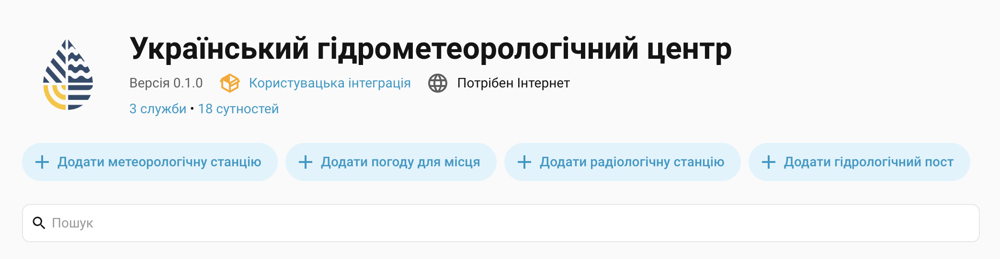
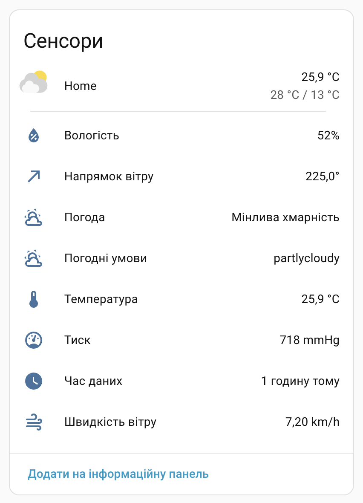
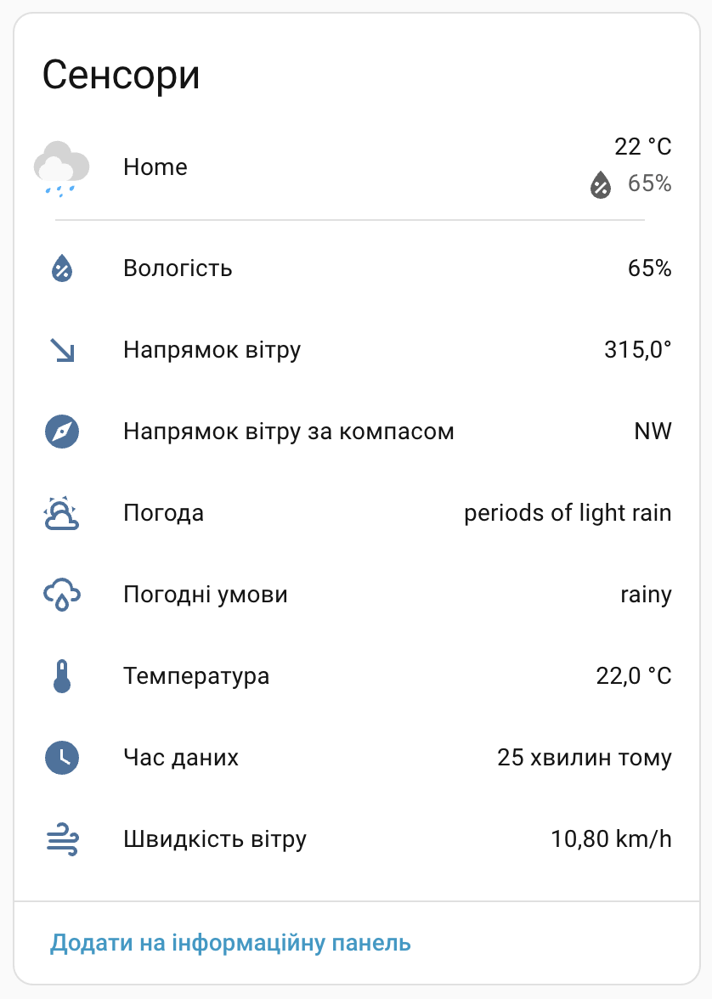
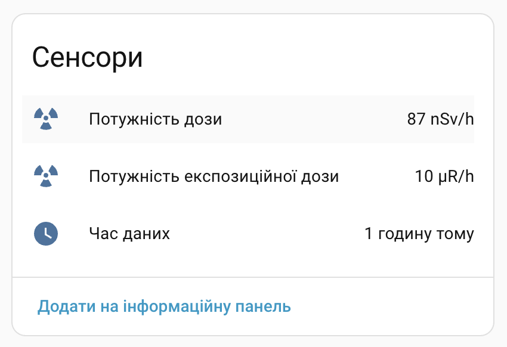
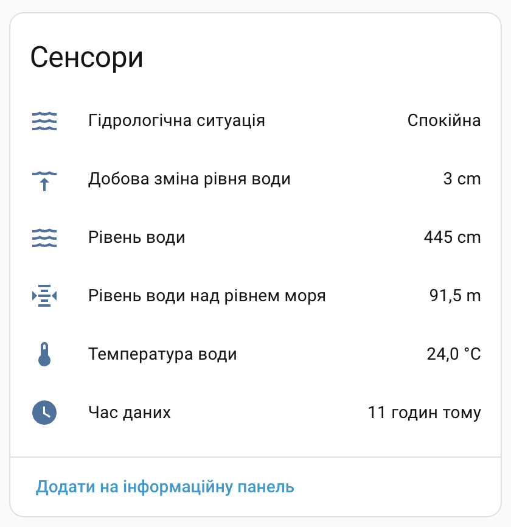

 

 

# 🌦️ Ukrainian Hydrometeorological Center for Home Assistant

[![GitHub Release][gh-release-image]][gh-release-url]
[![GitHub Downloads][gh-downloads-image]][gh-downloads-url]
[![hacs][hacs-image]][hacs-url]
[![GitHub Sponsors][gh-sponsors-image]][gh-sponsors-url]
[![Buy Me A Coffee][buymeacoffee-image]][buymeacoffee-url]
[![Twitter][twitter-image]][twitter-url]

[**English**](./readme.md) | [Українською](./readme.uk.md)

> [!NOTE]
> An integration for weather, radiation, and hydrology data from the [Ukrainian Hydrometeorological Center][ukr-hmc].

> [!IMPORTANT]
> This is an independent community project and is not affiliated with the Ukrainian Hydrometeorological Center.

This integration brings data from [meteo.gov.ua][ukr-hmc] into [Home Assistant][home-assistant] as native weather and sensor entities.

## Sponsorship

Your generosity will help me maintain and develop more projects like this one.

- 💖 [Sponsor on GitHub][gh-sponsors-url]
- ☕️ [Buy Me A Coffee][buymeacoffee-url]
- Bitcoin: `bc1q7lfx6de8jrqt8mcds974l6nrsguhd6u30c6sg8`
- Ethereum: `0x6aF39C917359897ae6969Ad682C14110afe1a0a1`

## Installation

The quickest way to install this integration is via [HACS][hacs-url] by selecting the button below:

[![Add to HACS via My Home Assistant][hacs-install-image]][hacs-install-url]

  
If the button doesn't work, add the repository manually

1. Open **HACS** → **Integrations** → **⋮** → **Custom repositories**.
2. Select **Add**.
3. Paste `https://github.com/denysdovhan/ha-ukr-hmc` as the repository URL.
4. Choose **Integration** as the category.
5. Find and install **Ukrainian Hydrometeorological Center**.

## Usage

This integration is configured through the Home Assistant UI. Select the button below to add it:

[![Add Ukrainian Hydrometeorological Center][install-image]][install-url]

  
If the button doesn't work, add the integration manually

1. Open **Settings** → **Devices & services**.
2. Select **Add integration** and search for **Ukrainian Hydrometeorological Center**.
3. Follow the setup steps.

## What it provides

This integration allows creating these entities:

| Source                       | Current data                                                                                   | Forecasts           |
| ---------------------------- | ---------------------------------------------------------------------------------------------- | ------------------- |
| Weather station              | Physical station measurements, including temperature, humidity, pressure, wind, and conditions | Daily and day/night |
| Weather location             | Forecast conditions for the selected map point; physical station measurements are not used     | Hourly and daily    |
| Radiation monitoring station | Direct µR/h and nSv/h readings with observation time                                           | —                   |
| Hydrology post               | Daily water measurements and the provider's hydrological situation                             | —                   |

### Weather

You can monitor weather conditions either by using a physical weather station or by selecting a location on the map. The integration provides both current conditions and forecasts.

The difference is in forecasts:

- **Weather stations** provide daily and day/night forecasts. Data is updated _every 3 hours_.
- **Weather locations** provide hourly and daily forecasts. Data is updated _every hour_.

| Weather station                                 | Weather location                                  |
| ----------------------------------------------- | ------------------------------------------------- |
|  |  |

### Radiation

You can monitor radiation levels by using a physical radiation monitoring station.

### Hydrology

You can monitor hydrological in Ukrainian rivers by using a physical hydrology post: water level, water temperature, conditions, etc.

## Removal

1. Open **Settings** → **Devices & services**.
2. Select **Ukrainian Hydrometeorological Center**.
3. Open the **⋮** menu and select **Delete**.
4. Remove the integration from HACS and restart Home Assistant if you no longer want the custom component installed.

## Development

Want to contribute to the project?

Thank you! Read the [contributing guide](./contributing.md) for more information.

## Other integrations

- 💥 [Aerial Danger](https://github.com/denysdovhan/ha-aerial-danger) — detects aerial-threat messages for selected Ukrainian regions and localities.
- ☁️ [Check Weather](https://github.com/denysdovhan/ha-check-weather) — creates a binary sensor based on forecast conditions for the next few hours.
- 💨 [LUN Misto Air](https://github.com/denysdovhan/ha-lun-misto-air) — provides air quality and environmental data from LUN Misto monitoring stations.
- ⚡️ [Yasno Outages](https://github.com/denysdovhan/ha-yasno-outages) — provides planned electricity outage schedules, sensors, and calendars from Yasno.

## License

MIT © [Denys Dovhan][denysdovhan]

<!-- Badges -->

[gh-release-url]: https://github.com/denysdovhan/ha-ukr-hmc/releases/latest
[gh-release-image]: https://img.shields.io/github/v/release/denysdovhan/ha-ukr-hmc?style=flat-square
[gh-downloads-url]: https://github.com/denysdovhan/ha-ukr-hmc/releases
[gh-downloads-image]: https://img.shields.io/github/downloads/denysdovhan/ha-ukr-hmc/total?style=flat-square
[hacs-url]: https://github.com/hacs/integration
[hacs-image]: https://img.shields.io/badge/hacs-custom-orange.svg?style=flat-square
[gh-sponsors-url]: https://github.com/sponsors/denysdovhan
[gh-sponsors-image]: https://img.shields.io/github/sponsors/denysdovhan?style=flat-square
[buymeacoffee-url]: https://buymeacoffee.com/denysdovhan
[buymeacoffee-image]: https://img.shields.io/badge/support-buymeacoffee-222222.svg?style=flat-square
[twitter-url]: https://x.com/denysdovhan
[twitter-image]: https://img.shields.io/badge/follow-%40denysdovhan-000000.svg?style=flat-square

<!-- References -->

[ukr-hmc]: https://www.meteo.gov.ua/
[home-assistant]: https://www.home-assistant.io/
[denysdovhan]: https://github.com/denysdovhan
[hacs-install-url]: https://my.home-assistant.io/redirect/hacs_repository/?owner=denysdovhan&repository=ha-ukr-hmc&category=integration
[hacs-install-image]: https://my.home-assistant.io/badges/hacs_repository.svg
[install-image]: https://my.home-assistant.io/badges/config_flow_start.svg
[install-url]: https://my.home-assistant.io/redirect/config_flow_start/?domain=ukr_hmc
